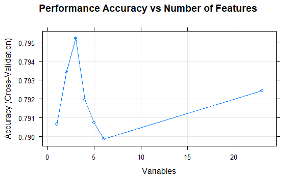

```{r setup, include=FALSE}
knitr::opts_chunk$set(echo = TRUE)

# Import libraries
library(tidyverse)
library(gridExtra)
library(caret)
library(MASS)
library(kableExtra)
library(broom)
library(reshape2)
library(modelr)
library(mlbench)
library(Hmisc)
library(randomForest)
library(leaps)
library(e1071)

# Set working directory
#setwd("E:/Documents/GitHub/SM3_Group_Project/Final Submission")

# Suppress warnings
options(warn=-1)
```

```{r include=FALSE}
# Read in the headers
headers <- read.csv(file = "train.csv", skip=1, header=F, nrows=1, as.is=T)

# Read in complete dataset
dat <- read.csv(file = "train.csv", skip = 2, header = F)

# Add the headers to dataset
colnames(dat) <- headers

# Remove the ID field
dat <- dat[ ,-1]

# Rename response variable for brevity
names(dat)[ncol(dat)]<-"y"
```

```{r wrap-hook}
#Wrap long lines:
library(knitr)
hook_output = knit_hooks$get('output')
knit_hooks$set(output = function(x, options) {
  # this hook is used only when the linewidth option is not NULL
  if (!is.null(n <- options$linewidth)) {
    x = knitr:::split_lines(x)
    # any lines wider than n should be wrapped
    if (any(nchar(x) > n)) x = strwrap(x, width = n)
    x = paste(x, collapse = '\n')
  }
  hook_output(x, options)
})
```
# Introduction

Managing the risk of default has always been a crucial aspect business for banks and other institutions offering credit card loans. Although in most jurisdictions there are legal consequences discouraging credit card default, it is still a critical issue that lenders have to contend with. Predicting whether or not a given borrower is likely to default on their credit card debt is complex problem. Statistical models can play an important role in minimising the risk of default. Lenders can use information about previous customers, including whether or not they have defaulted on their loans, to assess the likelihood that a potential new customer will default, given the known characteristics of that that individual.

Predictive modelling is the process of applying statistical techniques to reveal the relationship between a response variable and one or more predictor variables, inclulding whether a relationship exists at all, in order to make predictions given new data. There are a great number statistical techniques that can be used for this purpose, however most of these techniques will fall into one of two categories; regression or classification. In regression models, the response is a continuous variable. In classification models, the response is a categorical variable. When the response can only take two possible values, the problem is one of *binary classification*. Predicting whether or not a customer will default on their credit card loans is an example of a binary classification problem. In this project, we use a dataset consisting of 20,000 individuals, with their financial history, demographics and whether or not they have defaulted, and use this data to train a model to predict whether a new customer is likely to default on a loan. 

To generate the model, we used `caret`, a machine learning package for R. Functions from the `caret` package were used to help determine which predictors should be used in the model, and then to train and evaluate potential models. Before we began training models, we first performed exploratory data analysis. Sections 2 and 3 descibe the distributions of each variable in the data set, as well as relationships between predictor variables. This preliminary analysis allowed for a more efficient model selection process, as described in Section 4. The performance of several models that we considered is included in this section, with the best model presented in Section 5.

# 1. Cleaning and Preparing the Data

By inspecting the data, and using the \texttt{is.na} command on each variable, it was determined that there were no missing values in the data, so cleaning was not required. Next, each variable was inspected to ensure it is of the correct type. The data type for each variable is displayed in Table 1. 

```{r r, echo=FALSE}
data.desc <- data.frame(sapply(dat, class))
colnames(data.desc) <- ("Variable Type")
```

As shown, all variables are currently considered integers. This is not correct, as the only numeric variables are \texttt{LIMIT\_BAL}, \texttt{AGE}, \texttt{BILL\_AMT} and \texttt{PAY\_AMT}. The other variables were therefore converted to factors. The converted variable types, and a brief description of the data, are displayed in Table 2. 

```{r echo=FALSE}
# 
dat2 <- dat
dat2$SEX = as.factor(dat$SEX)
dat2$EDUCATION = as.factor(dat$EDUCATION)
dat2$MARRIAGE = as.factor(dat$MARRIAGE)
dat2$PAY_0 = as.factor(dat$PAY_0)
dat2$PAY_2 = as.factor(dat$PAY_2)
dat2$PAY_3 = as.factor(dat$PAY_3)
dat2$PAY_4 = as.factor(dat$PAY_4)
dat2$PAY_5 = as.factor(dat$PAY_5)
dat2$PAY_6 = as.factor(dat$PAY_6)
dat2$y = as.factor(dat$y)

data.desc.conv <- data.frame(sapply(dat2, class))
data.desc <- data.frame(data.desc,data.desc.conv)
colnames(data.desc) <- c("Raw Data Type", "Converted Data Type")
```

`r kable(data.desc, digits = 2, caption = "Converted Variable Types", format = "latex", booktabs = T)`

# 2. Univariate Analysis

## 2.1. Variable Descriptions

\begin{table}[h!]
\centering
\footnotesize
\centering
\caption{Description of variables in the data set.}
\label{Table:VarDesc}
\renewcommand{\arraystretch}{1.2}
\begin{tabular}{| c || c | c | p{'10cm}|}
\hline
\textbf{Variable Name} & \textbf{Data Type} & \textbf{Role in model} &\textbf{Description}\\ \hline\hline
\texttt{default payment next month} & \texttt{Factor} & \texttt{Response} &1 = a default payment, 0 = no default\\ \hline
\texttt{LIMIT\_BAL} & \texttt{Numeric} & \texttt{Predictor} & Amount of credit of an individual, in NT dollars\\ \hline
\texttt{SEX} & \texttt{Factor} & \texttt{Predictor} & Sex of an individual; 1 = male, 2 = female\\ \hline
\texttt{EDUCATION} & \texttt{Factor} & \texttt{Predictor} & Education status of an individual; 1 = graduate school, 2 = university, 3 = high school, 4 = other education\\ \hline
\texttt{MARRIAGE} & \texttt{Factor} & \texttt{Predictor} & Martial status of an individual; 1 = married, 2 = single, 3 = other\\ \hline
\texttt{AGE} & \texttt{Numeric} & \texttt{Predictor} & Age of an individual\\ \hline
\texttt{PAY\_0} to \texttt{PAY\_6} & \texttt{Factor} & \texttt{Predictor} & History of payment of an individual, from April (\texttt{PAY\_6}) to September (\texttt{PAY\_0}) 2015; -1 = on time, other values are months of delay in repayment\\ \hline
\texttt{BILL\_AMT1} to \texttt{BILL\_AMT6} & \texttt{Numeric} & \texttt{Predictor} & Amount of bill statement, from April (\texttt{BILL\_AMT6}) to September (\texttt{BILL\_AMT1}) 2015, in NT dollars\\ \hline
\texttt{PAY\_AMT1} to \texttt{PAY\_AMT6} & \texttt{Numeric} & \texttt{Predictor} & Amount of previous payment, from April (\texttt{PAY\_AMT6}) to September (\texttt{PAY\_AMT1}) 2015, in NT dollars\\ \hline
\end{tabular}
\end{table}

\newpage
\newpage

## 2.3. Univariate Plots

```{r echo=FALSE, fig.height=10, fig.width=10}

p1 <- ggplot(dat, aes(x = y)) +
  geom_histogram(bins = 2, col = "black") +
  ggtitle("Histogram of Default Payment Last Month") +
  xlab("Default Payment Last Month")

p2 <- ggplot(dat, aes(x = LIMIT_BAL)) +
  geom_histogram(bins = 50, col = "black") +
  ggtitle("Histogram of LIMIT_BAL") +
  xlab("Amount of credit of an individual")

p3 <- ggplot(dat, aes(x = SEX)) +
  geom_histogram(bins = 2, col = "black") +
  ggtitle("Histogram of Sex") +
  xlab("Sex of an individual; 1 = male, 2 = female")

p4 <- ggplot(dat, aes(x = EDUCATION)) +
  geom_histogram(bins = 4, col = "black") +
  ggtitle("Histogram of Education") +
  xlab("Education of an individual; 1 = graduate school, 2 = university, \n 3 = high school, 4 = other")

p5 <- ggplot(dat, aes(x = MARRIAGE)) +
  geom_histogram(bins = 4, col = "black") +
  ggtitle("Histogram of Marriage") +
  xlab("Martial status of an individual; 0 = ???, 1 = married, \n 2 = single, 3 = other")

p6 <- ggplot(dat, aes(x = AGE)) +
  geom_histogram(binwidth = 1, col = "black") +
  ggtitle("Histogram of Age") +
  xlab("Age of an individual")

# Output plots in 3x2 grid
grid.arrange(p1, p2, p3, p4, p5, p6, nrow = 3)
```


\newpage
# 3. Bivariate Analysis

In order to determine the nature and strength of the relationship between each predictor variable and the response variable, default payment next month, plots of each of these relationships will be produced and investigated. Determing the relative associations of these predictor variables is important, as it allows us to consider the implication of their inclusion in the final model.

## 3.1. Continous Variables
We will begin by considering the relationship of the continuous predictor variables against default payment next month. These relationships will be analysed using side-by-side box plots.

### 3.1.1. Limiting Balance against default payment next month

Given limiting balance is the amount of credit available to an individual, in NT dollars, the main areas of interest will be whether having a higher or lower limiting balance will influence defaulting next month's payment. We will investigate this using side-by-side box plots, shown below.

```{r LIMT_BAL, echo=FALSE, fig.height=5, fig.width=5}
ggplot(aes(x=as.factor(y), y=LIMIT_BAL, group=y),data=dat) + geom_boxplot() + ggtitle("Relationship between Limiting Balance and \n default payment next month") + theme(plot.title = element_text(hjust = 0.5)) + ylab("Limiting Balance") + xlab("Default Payment Next Month")
```

From observing the box plots above, it is clear that both levels of default payment next month are positively skewed.
We also see that the medians for both levels lie marginally closer to the lower quartile value than the upper. Although the upper and lower quartile values for those who do not default next month's payment lie above those who do respectively, the interquartile range for both levels overlap. Consider the median values for both levels shown below.

```{r LIMT_BAL medians}
print(median(dat$LIMIT_BAL[dat$y==0]))
print(median(dat$LIMIT_BAL[dat$y==1]))
```

The median limiting balance for those who do not default next month's payment is 150000, and 90000 for those who do default next month's payment. Thus it could be suggested that having a larger limiting balance amount may decrease the likelihood of defaulting next month's payment, however there is not sufficiently strong evidence to definitively conlude this. It should also be noted that both levels have potential outlier candidates.

### 3.1.2. Age against default payment next month

The next variable to be considered is Age, another integer variable taking values between 21 and 75. The relationship between Age and default payment next month will be investigated through side-by-side box plots.

```{r AGE, echo=FALSE, fig.height=5, fig.width=5}
ggplot(aes(x=as.factor(y), y=AGE, group=y),data=dat) + geom_boxplot() + ggtitle("Relationship between Age and \n default payment next month") + theme(plot.title = element_text(hjust = 0.5)) + ylab("Age") + xlab("Default Payment Next Month")
```

From observing the side-by-side box plots, we notice that both are positively skewed. Furthermore, the spread and median values for both levels of default payment next month are very similar, suggesting that there is no apparent trend for defaulting next month's payment based on Age.

```{r AGE medians}
print(quantile(dat$AGE[dat$y==0]))
print(quantile(dat$AGE[dat$y==1]))
```

Upon further inspection, the median values and the lower quartile values are the same for both levels, begin 34 and 28 respectively. Additionally, the upper quartile values for those who do default next month's payment and those who do not are  42 and 41 respectively. This further supports the suggestion that age does not influence whether or not next month's payment is defaulted. There are also potential outlier candidates for both levels.

### 3.1.3. Pay_X against default payment next month
PAY_X is a measure of an individual's payment history, with:

1. PAY_6 corresponding to the individuals payment in April.
2. PAY_5 corresponding to the individuals payment in May.
3. PAY_4 corresponding to the individuals payment in June.
4. PAY_3 corresponding to the individuals payment in July.
5. PAY_2 corresponding to the individuals payment in August.
6. PAY_0 corresponding to the individuals payment in September.

Each PAY_X is an integer variable, taking values between -2 and 8 (corresponding to month's the payment of that month was overdue). Hence, the relationship between Pay_X and default payment next month will be investigated using side-by-side boxplots.


```{r PAY_x, echo=FALSE, fig.height=10, fig.width=10}
p1 <- ggplot(aes(x=as.factor(y), y=PAY_0, group=y),data=dat) + geom_boxplot() + ggtitle("Relationship between PAY_0 and \n default payment next month") + theme(plot.title = element_text(hjust = 0.5)) + ylab("PAY_0") + xlab("Default Payment Next Month")

p2 <- ggplot(aes(x=as.factor(y), y=PAY_2, group=y),data=dat) + geom_boxplot() + ggtitle("Relationship between PAY_2 and \n default payment next month") + theme(plot.title = element_text(hjust = 0.5)) + ylab("PAY_2") + xlab("Default Payment Next Month")

p3 <- ggplot(aes(x=as.factor(y), y=PAY_3, group=y),data=dat) + geom_boxplot() + ggtitle("Relationship between PAY_3 and \n default payment next month") + theme(plot.title = element_text(hjust = 0.5)) + ylab("PAY_3") + xlab("Default Payment Next Month")

p4 <- ggplot(aes(x=as.factor(y), y=PAY_4, group=y),data=dat) + geom_boxplot() + ggtitle("Relationship between PAY_4 and \n default payment next month") + theme(plot.title = element_text(hjust = 0.5)) + ylab("PAY_4") + xlab("Default Payment Next Month")

p5 <- ggplot(aes(x=as.factor(y), y=PAY_5, group=y),data=dat) + geom_boxplot() + ggtitle("Relationship between PAY_5 and \n default payment next month") + theme(plot.title = element_text(hjust = 0.5)) + ylab("PAY_5") + xlab("Default Payment Next Month")

p6 <- ggplot(aes(x=as.factor(y), y=PAY_6, group=y),data=dat) + geom_boxplot() + ggtitle("Relationship between PAY_6 and \n default payment next month") + theme(plot.title = element_text(hjust = 0.5)) + ylab("PAY_6") + xlab("Default Payment Next Month")

# Output plots in 3x2 grid
grid.arrange(p1, p2, p3, p4, p5, p6, nrow = 3)
```

Observing these plots, we see that they are all positively skewed, with relatively low median values for both factor levels. Furthermore, other than for PAY_0, the median for both levels are equal. However, the upper quartile for all plots, other than PAY_6, is larger for those who do default next month's payment. Intuitively this makes sense, as we would expect defaulting next month's payment to be more likely if previous month's payments have also been late. There are also outlier candidates present in each of the plots.

### 3.1.4. BILL_AMTX against default payment next month
BILL_AMTX is the amount appearing on the bill statement as follows:

1. BILL_AMT6 corresponding to the individuals statement in April.
2. BILL_AMT5 corresponding to the individuals statement in May.
3. BILL_AMT4 corresponding to the individuals statement in June.
4. BILL_AMT3 corresponding to the individuals statement in July.
5. BILL_AMT2 corresponding to the individuals statement in August.
6. BILL_AMT1 corresponding to the individuals statement in September.

As BILL_AMTX is a numeric variable, we will investigate its relationship with default payment next month using side-by-side boxplots.

```{r BILL_AMTX, echo=FALSE, fig.height=10, fig.width=10}
p1 <- ggplot(aes(x=as.factor(y), y=BILL_AMT1, group=y),data=dat) + geom_boxplot() + ggtitle("Relationship between BILL_AMT1 and \n default payment next month") + theme(plot.title = element_text(hjust = 0.5)) + ylab("BILL_AMT1") + xlab("Default Payment Next Month")

p2 <- ggplot(aes(x=as.factor(y), y=BILL_AMT2, group=y),data=dat) + geom_boxplot() + ggtitle("Relationship between BILL_AMT2 and \n default payment next month") + theme(plot.title = element_text(hjust = 0.5)) + ylab("BILL_AMT2") + xlab("Default Payment Next Month")

p3 <- ggplot(aes(x=as.factor(y), y=BILL_AMT3, group=y),data=dat) + geom_boxplot() + ggtitle("Relationship between BILL_AMT3 and \n default payment next month") + theme(plot.title = element_text(hjust = 0.5)) + ylab("BILL_AMT3") + xlab("Default Payment Next Month")

p4 <- ggplot(aes(x=as.factor(y), y=BILL_AMT4, group=y),data=dat) + geom_boxplot() + ggtitle("Relationship between BILL_AMT4 and \n default payment next month") + theme(plot.title = element_text(hjust = 0.5)) + ylab("BILL_AMT4") + xlab("Default Payment Next Month")

p5 <- ggplot(aes(x=as.factor(y), y=BILL_AMT5, group=y),data=dat) + geom_boxplot() + ggtitle("Relationship between BILL_AMT5 and \n default payment next month") + theme(plot.title = element_text(hjust = 0.5)) + ylab("BILL_AMT5") + xlab("Default Payment Next Month")

p6 <- ggplot(aes(x=as.factor(y), y=BILL_AMT6, group=y),data=dat) + geom_boxplot() + ggtitle("Relationship between BILL_AMT6 and \n default payment next month") + theme(plot.title = element_text(hjust = 0.5)) + ylab("BILL_AMT6") + xlab("Default Payment Next Month")

# Output plots in 3x2 grid
grid.arrange(p1, p2, p3, p4, p5, p6, nrow = 3)
```

We see that all of these plots are positively skewed. Additionally, all side-by-side boxplots show that the median values for both levels of default payment next month lie withtin very close proximity of each other. Furthermore, there is also close similarities with the interquartile spread in each plot.

```{r BILL_AMTX medians, linewidth = 60}
print(Med_Def0 <- c(median(dat$BILL_AMT1[dat$y==0]), median(dat$BILL_AMT2[dat$y==0]), median(dat$BILL_AMT3[dat$y==0]), median(dat$BILL_AMT4[dat$y==0]), median(dat$BILL_AMT5[dat$y==0]), median(dat$BILL_AMT6[dat$y==0])))

print(Med_Def1 <- c(median(dat$BILL_AMT1[dat$y==1]), median(dat$BILL_AMT2[dat$y==1]), median(dat$BILL_AMT3[dat$y==1]), median(dat$BILL_AMT4[dat$y==1]), median(dat$BILL_AMT5[dat$y==1]), median(dat$BILL_AMT6[dat$y==1])))

```

Inspecting the median values for the 6 plots shows that the median value for BILL_AMT1, BILL_AMT2 AND BILL_AMT3 are higher for those who do not default next month's payment, where as this is reversed for BILL_AMT4, BILL_AMT5 and BILL_AMT6. This suggests that having a higher bill amount in recent month's will, in general, reduce the likelihood of defaulting next month's payment. However, the overlap in interquartile spread suggests that this influence is minimal. There are once again outlier candidates for both levels of default payment next month.

### 3.1.5. PAY_AMTX against default payment next month
PAY_AMTX is the amount of the previous payment, with:

1. PAY_AMT6 corresponding to the payment made in April.
2. PAY_AMT5 corresponding to the payment made in May.
3. PAY_AMT4 corresponding to the payment made in June.
4. PAY_AMT3 corresponding to the payment made in July.
5. PAY_AMT2 corresponding to the payment made in August.
6. PAY_AMT1 corresponding to the payment made in September.

As PAY_AMTX is a numeric variable, we will investigate its relationship with default payment next month using side-by-side boxplots.

```{r PAY_AMTX, echo=FALSE, fig.height=10, fig.width=10}
p1 <- ggplot(aes(x=as.factor(y), y=PAY_AMT1, group=y),data=dat) + geom_boxplot() + ggtitle("Relationship between PAY_AMT1 and \n default payment next month") + theme(plot.title = element_text(hjust = 0.5)) + ylab("PAY_AMT1") + xlab("Default Payment Next Month")

p2 <- ggplot(aes(x=as.factor(y), y=PAY_AMT2, group=y),data=dat) + geom_boxplot() + ggtitle("Relationship between PAY_AMT2 and \n default payment next month") + theme(plot.title = element_text(hjust = 0.5)) + ylab("PAY_AMT2") + xlab("Default Payment Next Month")

p3 <- ggplot(aes(x=as.factor(y), y=PAY_AMT3, group=y),data=dat) + geom_boxplot() + ggtitle("Relationship between PAY_AMT3 and \n default payment next month") + theme(plot.title = element_text(hjust = 0.5)) + ylab("PAY_AMT3") + xlab("Default Payment Next Month")

p4 <- ggplot(aes(x=as.factor(y), y=PAY_AMT4, group=y),data=dat) + geom_boxplot() + ggtitle("Relationship between PAY_AMT4 and \n default payment next month") + theme(plot.title = element_text(hjust = 0.5)) + ylab("PAY_AMT4") + xlab("Default Payment Next Month")

p5 <- ggplot(aes(x=as.factor(y), y=PAY_AMT5, group=y),data=dat) + geom_boxplot() + ggtitle("Relationship between PAY_AMT5 and \n default payment next month") + theme(plot.title = element_text(hjust = 0.5)) + ylab("PAY_AMT5") + xlab("Default Payment Next Month")

p6 <- ggplot(aes(x=as.factor(y), y=PAY_AMT6, group=y),data=dat) + geom_boxplot() + ggtitle("Relationship between PAY_AMT6 and \n default payment next month") + theme(plot.title = element_text(hjust = 0.5)) + ylab("PAY_AMT6") + xlab("Default Payment Next Month")

# Output plots in 3x2 grid
grid.arrange(p1, p2, p3, p4, p5, p6, nrow = 3)
```

We see that all of these plots are positively skewed. Additionally, all side-by-side boxplots show that the median, lower quartile and upper quartile values lie within very close proximity. 

```{r PAY_AMTX medians, linewidth = 60}
print(Median_Def0 <- c(median(dat$PAY_AMT1[dat$y==0]), median(dat$PAY_AMT2[dat$y==0]), median(dat$PAY_AMT3[dat$y==0]), median(dat$PAY_AMT4[dat$y==0]), median(dat$PAY_AMT5[dat$y==0]), median(dat$PAY_AMT6[dat$y==0])))

print(Median_Def1 <- c(median(dat$PAY_AMT1[dat$y==1]), median(dat$PAY_AMT2[dat$y==1]), median(dat$PAY_AMT3[dat$y==1]), median(dat$PAY_AMT4[dat$y==1]), median(dat$PAY_AMT5[dat$y==1]), median(dat$PAY_AMT6[dat$y==1])))

```

Upon further inspection, the median values are marginally larger for those who do not default next month's payment, so there may be a very small influence. There are outlier candidates for both levels of default payment next month.

## 3.2. Categorical Variables
We now consider the relationship between the categorical predictor variables and the response variable. These will be explored using side-by-side box plots where appropriate, otherwise analysing the mean values.

## 3.2.1. Sex against default payment next month

The next variable to be considered is Sex. As Sex and default payment next month are both integer variables with two levels (0 and 1 for default payment next month, 1 and 2 for sex) their relationship will be investigated by considering the default rates for both males and females.

```{r SEX, echo=FALSE}
print(male_def <- sum(dat$y[dat$SEX==1])/sum(dat$SEX==1))
print(female_def <- sum(dat$y[dat$SEX==2])/sum(dat$SEX==2))
```

Considering the above output, approximately 29.10\% of males defaulted next month's payment, whereas only 25.23\% did. This suggests that males may be more likely, on average, to default next month's payment.

## 5.2.2 Education against default payment next month

Education is another integer variable, taking 7 different levels, ranging from 0 to 6. We will once again consider side-by-side boxplots to investigate their relationship.

```{r Education, echo=FALSE}
ggplot(aes(x=as.factor(y), y=EDUCATION, group=y),data=dat) + geom_boxplot() + ggtitle("Relationship between Education and \n default payment next month") + theme(plot.title = element_text(hjust = 0.5)) + ylab("Education") + xlab("Default Payment Next Month")
mean(dat$EDUCATION[dat$y==0])
mean(dat$EDUCATION[dat$y==1])
```

The mean level of education for those who do not default next month's payment is 1.84, whereas for those who do it's 1.89. Due to how close these are in value, it is unreasonable to suggest that the level of education of an individual will effect whether or not they default.

### 3.2.3. Marriage against default payment next month

We will now consider Marriage, another integer variable with four levels (0 up to 3). Because there are only four levels, no plot will be considered to investigate their relationship.

```{r MARRIAGE, echo=TRUE}
print(mean(dat$MARRIAGE[dat$y==0]))
print(mean(dat$MARRIAGE[dat$y==1]))
```

The mean marriage value for those who do not default next month's payment is 1.56, whereas this value is 1.53 for those who do. These values are once again so close in value that there is no suggestion of a relationship between these two variables.

## 3.3. Bivariate Analysis Between Predictors

In order to determine the strength of the relationships between predictors, we look at the correlation between the numeric predictor variables. This is shown in the graphic below.


```{r correlation, echo=FALSE}
# Convert necessary variables to factors
dat$SEX = as.factor(dat$SEX)
dat$EDUCATION = as.factor(dat$EDUCATION)
dat$MARRIAGE = as.factor(dat$MARRIAGE)
dat$PAY_0 = as.factor(dat$PAY_0)
dat$PAY_2 = as.factor(dat$PAY_2)
dat$PAY_3 = as.factor(dat$PAY_3)
dat$PAY_4 = as.factor(dat$PAY_4)
dat$PAY_5 = as.factor(dat$PAY_5)
dat$PAY_6 = as.factor(dat$PAY_6)
dat$y = as.factor(dat$y)

dat.num <- Filter(is.numeric, dat)
cor <- round(cor(dat.num),2)
ggplot(melt(cor), aes(x=Var1, y=Var2, fill=value))+geom_tile()+
 theme(axis.text.x = element_text(angle = 90, vjust = 1, hjust = 1))+
  ggtitle("Correlation Between Numeric Predictors")+
  theme(plot.title = element_text(hjust = 0.5)) + xlab("") + ylab("")

# Get the correlation matrix for the correlated variables
cor.reduced <- round(cor(dat.num[,3:8]),2)
kable(cor.reduced) %>%
  kable_styling("striped", full_width = F) %>%
  row_spec(0, angle = -90)
```

Looking at the correlations, we see that there is high correlation between each of the BILL_AMT_x variables. The precise correlations for the BILL_AMT_x variables have been included in a table.  

# 4. Model Fitting
## 4.1. Feature Engineering

Choosing an appropriate subset from the available predictor variables is an important step in selecting an accurate model. While the exclusion of important predictors will produce an incorrect model, adding too many redundant predictor terms can overcomplicate the model, making it harder to interpret without improving its accuracy. It can also reduce the statistical accuracy of parameter estimates. In machine learning, the process of selecting predictor variables for a model is know as *feature selection* ('feature' being a commonly used term for  predictor variables). 

The other activity that makes up feature engineering is *Feature extraction*. This is the process of building new features out of the available predictor variables in the data set. Additional features that we considered were interaction terms, which are often appropriate when there is an observed relationship between features. We note from the previous section that there is a strong correlation between the `BILL_AMT` variables. 

We perform feature selection on the credit dataset using the Recursive Feature Elimination, which is a backwards selection technique that begins with all available features, and iteratively eliminates the least important ones. The model that was used to select features in this way was a random forest.  

```{r echo=FALSE}
# Separate into training and test sets
set.seed(889)
trainIndex <- createDataPartition(dat$y, p = .7, list = FALSE, times = 1)
train.set <- dat[trainIndex,]
test.set <- dat[-trainIndex,]

# Get the 
train.set_X <- train.set[,1:23]
train.set_y <- train.set[,24]

# Set the cross validation control
ctrl <- rfeControl(functions=rfFuncs, method="cv", number=10)

# Get the optimal features for a random forest model
# results <- rfe(train.set_X, train.set_y, sizes = c(1,2,3,4,5,6,10,15), rfeControl = ctrl)

# Output the results
# plot(results, type = c("g","o"), main = "Performance Accuracy vs Number of Features")
# predictors(results)
```


For the random forest model we examined using Recursive Feature Elimination, it was first found that the most accurate model consisted of just three features, as shown in Figure 1. `PAY_0`, `PAY_2` and `PAY_3`. It was decided that a random forest model including just these three predictors would be trained. 

```{r eval=FALSE, include=FALSE}
# results_2 <- rfe(train.set_X, train.set_y, sizes = c(1,2,3,4,5,6), rfeControl = ctrl)
# plot(results_2, type = c("g","o"), main = "Performance Accuracy vs Number of Features")
# predictors(results_2)
```

Unlike the random forest model, both the logistic regression model and the single decision tree model were able to be trained in a reasonable timeframe with all features included. The optimal feature set for each of these models was therefore examined at the model training and evaulation stage. 

## 4.2. Model Selection

Given that this problem is one of binary classification, the following types of models were considered, all of which are commonly applied to binary classification problems 

* Logistic regression
* Linear Support Vector Machine
* Kernelised Support Vector Machine
* Decision tree
* Random forest
* AdaBoost

Each of the models considered was trained using the `train()` function from the `caret` package. After attempting to train support vector machines, an AdaBoost model, and the reduced random forest with the selected features above, none were found to be able to train in a reasonable timeframe, and so had to be abandoned. 

Consequently, the two models that we trained initially were a logisitic regression model and a decision tree model, both with all features included.

```{r echo=FALSE}
set.seed(68)

# Set control for cross validation
Fitctrl <- trainControl(method="cv", number=10)

# Train logistic regression model using caret
mdl_logistic.1 <- train(y~., data=train.set, method="glm", family=binomial(), trControl=Fitctrl)

# Train decision model
mdl_dt.1 <- train(y~., data=train.set, method="ctree", trControl=Fitctrl)

# Generate predicted classifications on test set for each model
pred_logistic.1 <- predict(mdl_logistic.1,test.set)
pred_dt.1 <- predict(mdl_dt.1,test.set)

# Store the results
cm_logistic.1 <- confusionMatrix(pred_logistic.1, test.set$y)
cm_dt.1 <-  confusionMatrix(pred_dt.1,test.set$y)

# Extract the accuracy of each model
accuracy_logistic.1 <- cm_logistic.1$overall[1]
accuracy_dt.1 <- cm_dt.1$overall[1]

# Output the accuracy results in table
models_list <- c("Logistic Regression", "Decision Tree")
accuracy_list <- c(round(accuracy_logistic.1*100,3), round(accuracy_dt.1*100,3))
accuracy_tbl.1 <- data.frame(Model=models_list, Accuracy=accuracy_list)
```

`r kable(accuracy_tbl.1, digits = 2, caption = "Test Accuracy of Trained Models", format = "latex", booktabs = T)`

In the above R code, a logistic model was generated using `caret`, as well as using the standard R `glm()` function. As it proved difficult to use caret's functionality to automatically select optimal features using our preferred criterion, we instead used the stepwise AIC function. None of the features identified in this model exhibited a meaningful correlation, and so we did not include interactiion terms between any of the features. 

We also trained a decision tree model using only those predictors identified through the recursive feature elminiation exercise for random forest, to check the accuracy of a more parsimonious feature set.

```{r echo=FALSE}
# Get a reduced logistic model using stepwise AIC 
mdl_logistic_full <- glm(y~., data=train.set, family = binomial(logit))
mdl_logistic.2 <- stepAIC(mdl_logistic_full, direction = "both", trace = FALSE)

# Set up training set for the reduced decision tree model 
train.set.logistic.2 <- train.set[,c("LIMIT_BAL","SEX","EDUCATION","MARRIAGE","PAY_0","PAY_3","PAY_4","PAY_5","PAY_6","BILL_AMT2","PAY_AMT1","PAY_AMT2","y")]
train.set.df.2 <- train.set[,c("PAY_0", "PAY_2", "PAY_3", "y")]

# Get the reduced logistic regression model using cross-validation
mdl_logistic.2 <-  train(y~., data=train.set.logistic.2, method="glm", family=binomial(), trControl=Fitctrl)

# Get the reduced decision tree model
mdl_dt.2 <- train(y~., data=train.set.df.2, method="ctree", trControl=Fitctrl)
```

## 4.3. Model Testing and Evaluation

The trained models were tested against a portion of the original data set that had been randomly selected for testing purposes. Predicted values for the response variable are obtained, and then the accuracy of these predictions is stored using the `confusionMatrix()` function. 

```{r echo=FALSE}
# Get the reduced test sets
test.set.logistic.2 <- test.set[,c("LIMIT_BAL","SEX","EDUCATION","MARRIAGE","PAY_0","PAY_3","PAY_4","PAY_5","PAY_6","BILL_AMT2","PAY_AMT1","PAY_AMT2","y")]
test.set.df.2 <- test.set[,c("PAY_0", "PAY_2", "PAY_3", "y")]

# Generate predicted classifications on test set with each model
pred_logistic.2 <- predict(mdl_logistic.2,test.set.logistic.2)
pred_dt.2 <- predict(mdl_dt.2,test.set.df.2)

# Store the results
cm_logistic.2 <- confusionMatrix(pred_logistic.2, test.set$y)
cm_dt.2 <-  confusionMatrix(pred_dt.2,test.set.df.2$y)

# Extract the accuracy of each model
accuracy_logistic.2 <- cm_logistic.2$overall[1]
accuracy_dt.2 <- cm_dt.2$overall[1]

# Output the accuracy results in table
models_list <- c("Logistic Regression", "Reduced Logistic Regression", "Decision Tree", "Reduced Decision Tree")
accuracy_list <- c(round(accuracy_logistic.1*100,3), round(accuracy_logistic.2*100,3), round(accuracy_dt.1*100,3), round(accuracy_dt.2*100,3))
accuracy_tbl <- data.frame(Model=models_list, Accuracy=accuracy_list)
```

`r kable(accuracy_tbl, digits = 2, caption = "Test Accuracy of All Trained Models", format = "latex", booktabs = T)`

# 5. Final Model

Having attempted several different approaches, we found that only two could be trained in a practical timeframe. These were logistic regression and a single decision tree. Our preliminary feature selection work was not directly applicable to our final model selection decisions, given that it proved too resource-intensive to train even a reduced random forest model on the data set. However, given the random forests are an aggregation of decision trees, we chose to try training a decision tree with only the three features that were identified as important for the random forest.

To obtain a more parsimonious logistic regression model, we applied stepwise selection using the Akaike Information Criterion to determine feature significance. The features that were identified through this process were then extracted, and a new model was trained, using cross validation, on the reduced feature set. 

In total, we trained four different models; two decision trees and two logistic regression models. We trained these models several times as they were each being developed, and typically found little variability in terms of their classification accuracy. However, the logisitic regression models performed slightly better than the decision tree models, and reduced logistic model showed very similar or slightly better perfomance than the full model. In the interests of model simplicity, we have opted to use the reduced logistic regression model to make our predictions. 

```{r}
# Save the final model
saveRDS(mdl_logistic.2, "./final_model.rds")
```


